# PlantUML Syntax Reference

## Contents
- Sequence Diagram
- Class Diagram
- Activity Diagram
- State Diagram
- Component Diagram
- ER Diagram
- Mind Map
- Gantt Chart
- C4 Context Diagram
- C4 Container Diagram
- C4 Component Diagram
- JSON Visualization
- Styling

Complete syntax examples for all diagram types.

## Sequence Diagram

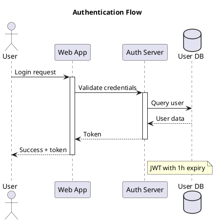

Arrow types:
- `->` solid line, solid arrow
- `-->` dashed line, solid arrow
- `->>` solid line, open arrow
- `-->>` dashed line, open arrow
- `<->` bidirectional

## Class Diagram

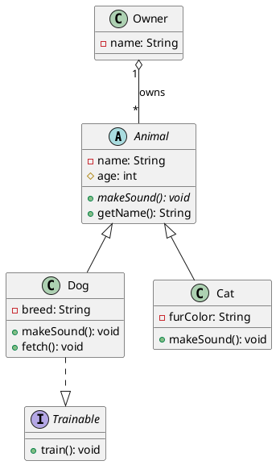

Relationships:
- `<|--` extension (inheritance)
- `<|..` implementation
- `*--` composition (filled diamond)
- `o--` aggregation (empty diamond)
- `-->` dependency
- `--` association

## Activity Diagram

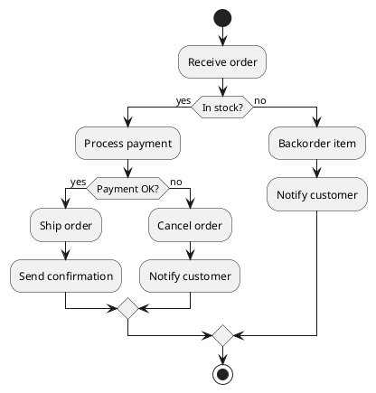

Constructs:
- `:action;` - activity
- `if (cond) then (yes) else (no) endif`
- `fork` / `fork again` / `end fork` - parallel
- `while (cond)` / `endwhile`
- `repeat` / `repeat while (cond)`

## State Diagram

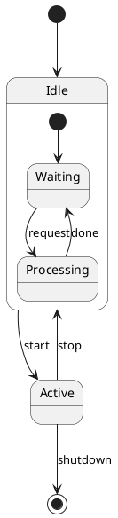

## Component Diagram

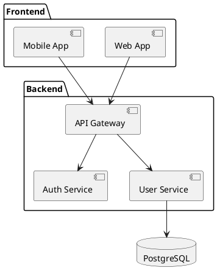

## ER Diagram

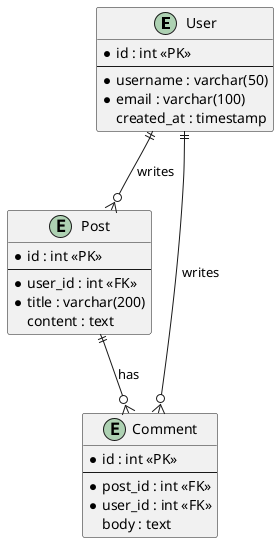

Cardinality: `||` one, `o{` many optional, `|{` many required

## Mind Map

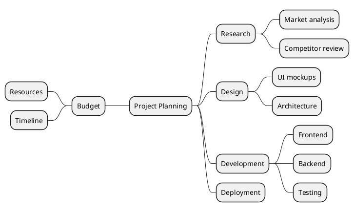

Use `*` for right side (default), add `left side` for left branches.

## Gantt Chart

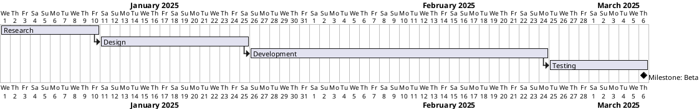

## C4 Context Diagram

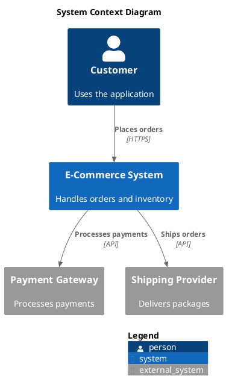

## C4 Container Diagram

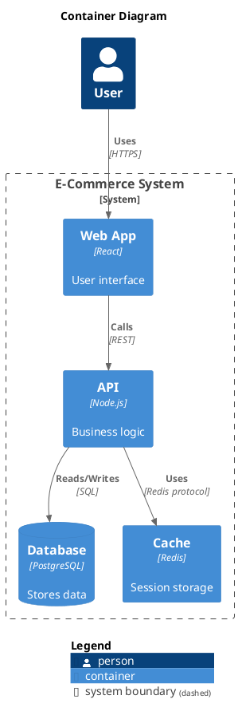

## C4 Component Diagram

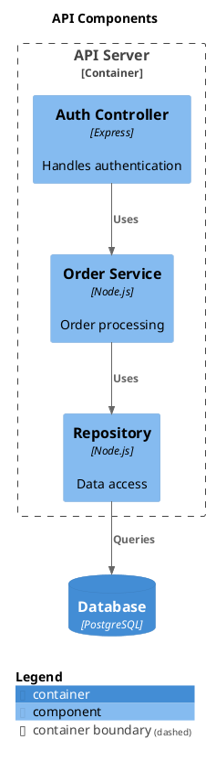

## JSON Visualization

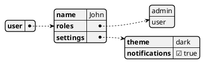

## Styling

Common skinparams:
```plantuml
@startuml
skinparam backgroundColor #FEFEFE
skinparam handwritten true
skinparam monochrome true
skinparam shadowing false
skinparam defaultFontName "Source Code Pro"
' ... diagram content
@enduml
```
